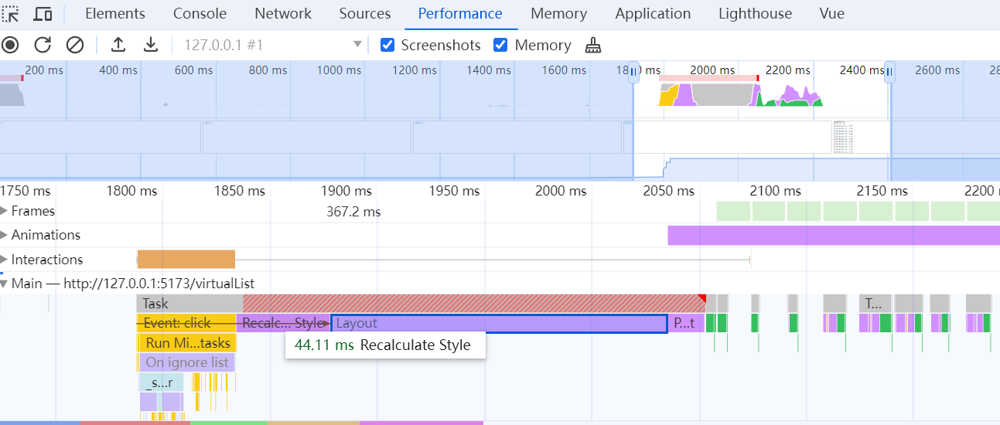

# 前言
工作中，遇到一些需要不能使用分页方式来加载列表数据的业务场景。对于这种情况，我们称这种列表叫做`长列表`。
使用`时间分片`的方式更适用于列表项的DOM结构十分简单的情况。这里介绍使用`虚拟列表`的方式，来同时加载大量数据。

# 为什么要使用虚拟列表

假设我们的长列表需要展示10000条记录，我们同时将10000条记录渲染到页面中，先来看看需要花费多长时间

```html
<button id="button">button</button><br>
<ul id="container"></ul>  
```

- 在JS的`Event Loop`中，当JS引擎所管理的执行栈中的事件以及微任务事件全部执行完后，才会触发渲染线程对页面进行渲染
- 第一个console.log的触发时间是在页面进行渲染之前，此时得到的间隔时间为js运行所需要的时间
- 第二个console.log是放到nextTick(js也可以是setTimeout ,0 )中，它的触发时间是在渲染完成，在下一次Event Loop中执行的



从 Performance 可以看出，代码从执行到渲染结束，消耗时间最多的两个阶段是 `Recalculate Style` 和 `Layout` 。
- `Recalculate Style`: 样式计算，浏览器根据css选择器计算哪些元素应该应用哪些规则，确定每个元素具体的样式。
- `Layout`: 布局，知道元素应用哪些规则之后，浏览器开始计算它要占据的空间大小及其在屏幕的位置。

在实际的工作中，列表项必然不会像例子中仅仅只由一个li标签组成，必然是由复杂DOM节点组成的。

那么可以想象的是，当列表项数过多并且列表结构复杂的时候，同时渲染时，会在`Recalculate Style`和`Layout`阶段消耗大量的时间。

而`虚拟列表`就是解决这一问题的一种实现。


# 什么是虚拟列表